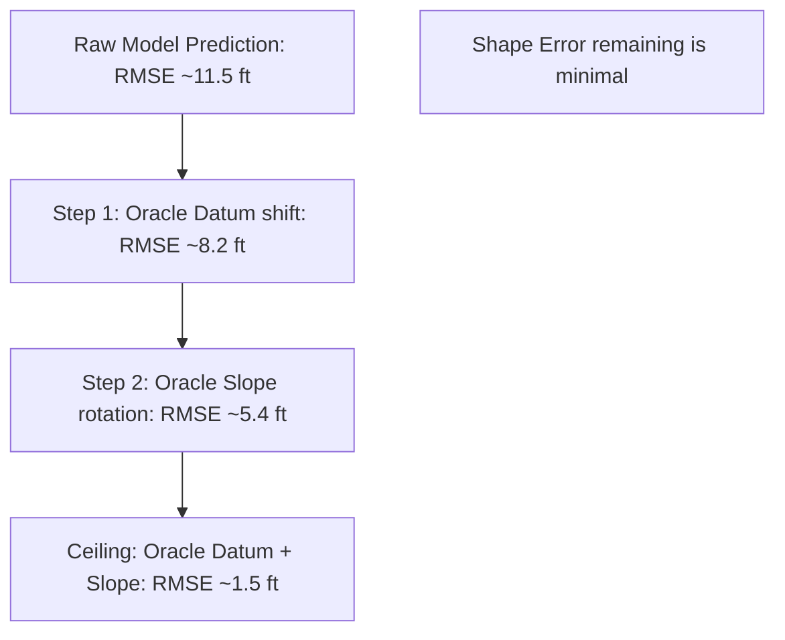

# 04. Signal Decomposition & The Oracle Ladder Diagnostics

This document presents the mathematical proof of why geosteering models drift and outlines the **Oracle-Ceiling Ladder** formulation used to isolate and quantify structural errors.

---

## 1. Wiggle vs. Trend Decomposition

The stratigraphic position $\text{TVT}_t$ of the wellbore path at step $t$ along the horizontal section is represented as:

$$\text{TVT}_t = Z_t - \mathcal{S}(X_t, Y_t)$$

Where:
*   $Z_t$ is the known vertical coordinate of the trajectory (measured subsea elevation).
*   $\mathcal{S}(X_t, Y_t)$ is the unknown elevation of the geological datum boundary.

Let us expand $\mathcal{S}(X_t, Y_t)$ using a first-order Taylor expansion around the starting point of the masked Toe section $(X_0, Y_0)$:

$$\mathcal{S}(X_t, Y_t) \approx \mathcal{S}(X_0, Y_0) + \nabla \mathcal{S} \cdot \left[ \begin{array}{c} X_t - X_0 \\ Y_t - Y_0 \end{array} \right]$$

Letting $D_0 = \mathcal{S}(X_0, Y_0)$ represent the absolute vertical elevation (the **Datum**) at the Heel-Toe transition, and $\mathbf{m} = \nabla \mathcal{S} = [m_x, m_y]^T$ represent the regional geological slope (the **Dip**), we can rewrite the TVT equation as:

$$\text{TVT}_t \approx Z_t - D_0 - \big( m_x (X_t - X_0) + m_y (Y_t - Y_0) \big)$$

Group the terms by physical characteristics:

$$\text{TVT}_t = \underbrace{\big( Z_t - \mathbf{m} \cdot \mathbf{x}_t \big)}_{\text{Wiggle (High-Frequency)}} - \underbrace{D_0}_{\text{Datum (Low-Frequency)}}$$

*   **The Wiggle:** Captures the vertical variations of the trajectory relative to the dipping plane. Since we measure coordinates with high precision, this component has zero structural drift.
*   **The Datum ($D_0$):** Captures the absolute starting depth. If $D_0$ is off, the entire sequence is shifted.

---

## 2. Mathematical Proof of GR Unidentifiability
Why can't Gamma Ray logs resolve the absolute datum?

Let the Gamma Ray signature of the formation be a function of the stratigraphic position: $\text{GR}_t = f(\text{TVT}_t)$.

Suppose the wellbore is drilling inside a thick shale layer where the GR is constant: $f(\text{TVT}) = C, \quad \forall \text{TVT} \in [a, b]$.

The loss function for sequence matching is:

$$\mathcal{L}(D_0) = \sum_{t=1}^{T} \big( \text{GR}_t - f(\text{TVT}_t(D_0)) \big)^2$$

If the true TVT and the predicted TVT both reside within the shale interval $[a, b]$, then:

$$f(\text{TVT}_t(D_0)) = C$$

Taking the partial derivative of the loss function with respect to the starting datum $D_0$:

$$\frac{\partial \mathcal{L}}{\partial D_0} = \sum_{t=1}^{T} 2 \big( \text{GR}_t - C \big) \cdot \frac{\partial f}{\partial \text{TVT}} \cdot \frac{\partial \text{TVT}_t}{\partial D_0}$$

Since $f(\text{TVT})$ is constant inside this interval, the derivative $\frac{\partial f}{\partial \text{TVT}} = 0$. Therefore:

$$\frac{\partial \mathcal{L}}{\partial D_0} = 0$$

### Conclusion of the Proof:
Because the gradient of the loss function is zero, **no gradient-descent optimizer or sequence matching algorithm can recover the absolute datum $D_0$ using GR alone** when operating inside homogeneous geological zones. The model cannot know if it is at the top, middle, or bottom of the shale layer.

---

## 3. Mathematical Formulation of the Oracle Ladder

To diagnostic our model's performance, we decompose our prediction vector $\hat{\mathbf{y}} = [\hat{y}_1, \dots, \hat{y}_T]^T$ and compare it to the true TVT vector $\mathbf{y} = [y_1, \dots, y_T]^T$ over the masked Toe section.

### Step 1: Oracle Datum Shift
This step removes the starting vertical shift error. We calculate the mean offset between prediction and ground truth, and shift the prediction:

$$\hat{y}_{t}^{\text{datum}} = \hat{y}_t - (\bar{\hat{\mathbf{y}}} - \bar{\mathbf{y}})$$

Where $\bar{\hat{\mathbf{y}}} = \frac{1}{T} \sum_{t=1}^{T} \hat{y}_t$ and $\bar{\mathbf{y}} = \frac{1}{T} \sum_{t=1}^{T} y_t$.
*   **What this tells us:** If the RMSE drops significantly after this shift, your model has a **datum prediction issue** (the sequence shape is correct, but shifted vertically).

### Step 2: Oracle Slope Rotation
This step removes the slope (dip) prediction error. We fit a linear regression line to both $\mathbf{y}$ and $\hat{\mathbf{y}}$ relative to the Measured Depth to find the true slope $m_{\text{true}}$ and predicted slope $m_{\text{pred}}$. We then rotate the predicted path around its midpoint:

$$\hat{y}_{t}^{\text{slope}} = \hat{y}_t - (m_{\text{pred}} - m_{\text{true}}) \cdot \left( t - \frac{T}{2} \right)$$

*   **What this tells us:** If the RMSE drops significantly after rotation, your model has a **dip extrapolation issue** (it is failing to predict the structural dip plane over the Toe).

### Step 3: Oracle Shape (The Ceiling)
We construct the perfect shape path by taking the true TVT sequence and applying the predicted model's mean shift and slope:

$$\hat{y}_{t}^{\text{shape}} = y_t + (\bar{\hat{\mathbf{y}}} - \bar{\mathbf{y}}) + (m_{\text{pred}} - m_{\text{true}}) \cdot \left( t - \frac{T}{2} \right)$$

*   **What this tells us:** This measures the absolute limit of performance if we only fix the shape matching. The remaining RMSE is the "Shape Error ceiling," which is typically very small ($\approx 1.5$ feet). This proves that **improving the model's high-frequency shape capabilities has negligible impact** compared to improving datum and dip plane estimations.
