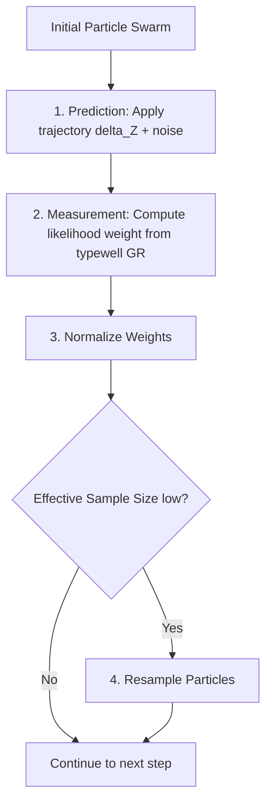

# 05. Advanced Geosteering Algorithms & Scaling Pitfalls

This document details the mathematical algorithms used for sequence tracking and explains the critical "Z-score scaling pitfall" and "Linear Tree extrapolation logic" that separate top-tier pipelines from baseline models.

---

## 1. Viterbi Sequence Tracking & Dynamic Warping

To align the horizontal lateral Gamma Ray sequence with the vertical typewell reference, we discretize the TVT state space into $M$ bins: $\mathbf{s} = [s_1, s_2, \dots, s_M]^T$ (e.g., from 0 to 120 feet in 0.2-foot increments).

Let:
*   $O_t$ be the observed horizontal Gamma Ray value at step $t$ along the Measured Depth.
*   $\Delta Z_t$ be the physical elevation change of the wellpath between step $t-1$ and $t$.
*   $C(i, t)$ be the minimum cumulative cost to reach TVT state $s_i$ at time step $t$.

### Recurrence Relation:

$$C(i, t) = \min_{j \in \{1,\dots,M\}} \Big\{ C(j, t-1) + \mathcal{T}(j \to i, \Delta Z_t) \Big\} + \mathcal{D}(O_t, \text{Typewell}(s_i))$$

Where:
*   **Measurement Cost ($\mathcal{D}$):** Measures the discrepancy between the observed GR and the typewell's GR at state $s_i$:
    
    $$\mathcal{D}(O_t, \text{Typewell}(s_i)) = \big( O_t - \text{TypewellGR}(s_i) \big)^2$$

*   **Transition Penalty ($\mathcal{T}$):** Penalizes stratigraphic movements that deviate from the physical trajectory:
    
    $$\mathcal{T}(j \to i, \Delta Z_t) = \lambda \cdot \big( (s_i - s_j) - \Delta Z_t \big)^2$$

    Here, $\lambda$ is a regularization weight controlling the rigidity of the path.

---

## 2. The Z-Score Scaling Pitfall (The Flat-Line Bug)

A common mistake in ML engineering is to apply standard scaling (z-score standardization) to all features before running the Viterbi solver:

$$\text{GR}_{\text{scaled}} = \frac{\text{GR} - \mu}{\sigma}$$

If z-scored GR values are used to compute the measurement cost $\mathcal{D}$, the squared difference will be bounded:

$$\mathcal{D}(O_t, \text{Typewell}(s_i)) \in [0, 9.0] \quad (\text{typically } \approx 0.05 \text{ to } 1.0)$$

Meanwhile, if the transition penalty parameter $\lambda$ is set to a standard value (e.g., 20.0), then the transition penalty component dominates the cost function:

$$\mathcal{T}(j \to i, \Delta Z_t) \gg \mathcal{D}(O_t, \text{Typewell}(s_i))$$

### The Resulting Bug:
Because the transition penalty is so high compared to the squashed measurement cost, the Viterbi algorithm will choose the path that has the absolute minimum transition cost:

$$s_i - s_j = \Delta Z_t \implies \Delta \text{TVT}_t = \Delta Z_t$$

This causes the tracker to simply copy the vertical wiggles of the physical wellpath, outputting a flat prediction relative to the geological layers. The model completely ignores the Gamma Ray log.

```
       True TVT (Dipping)                     Predicted TVT (Z-Scored Bug)
       \                                       \
        \______                                 \________________________ (Flat line)
               \                                
                \______                         
```

### The Fix:
1.  **Use Raw API Units:** Keep Gamma Ray in raw API units (0 to 200) for Viterbi calculation. This makes the squared difference range up to $40,000$, ensuring the observation cost has enough weight to pull the tracker across states.
2.  **Calibrate $\lambda$:** Set the transition penalty $\lambda$ to balance the raw GR differences. A typical tuned ratio is:
    
    $$\lambda = \frac{\text{Mean}(\text{GR}_{\text{raw}})^2}{100} \approx 20.0 \text{ to } 80.0$$

---

## 3. Particle Filtering (Sequential Monte Carlo)

For real-time probabilistic tracking, we maintain $N_p$ particles representing potential stratigraphic positions.



### The Algorithm:
1.  **Prediction Phase:** For each particle $p \in \{1,\dots,N_p\}$, project the TVT state forward:
    
    $$\text{TVT}_t^{(p)} = \text{TVT}_{t-1}^{(p)} + \Delta Z_t - \mathbf{m} \cdot \Delta \mathbf{x}_t + \eta_t, \quad \eta_t \sim \mathcal{N}(0, \sigma_{\text{sys}}^2)$$

    Where $\mathbf{m}$ is the estimated regional dip vector and $\sigma_{\text{sys}}^2$ is the system transition variance.
2.  **Measurement Update Phase:** Calculate the weight of each particle based on the likelihood of the observed GR:
    
    $$w_t^{(p)} = w_{t-1}^{(p)} \cdot \frac{1}{\sqrt{2\pi\sigma_{\text{obs}}^2}} \exp\left( - \frac{\big( O_t - \text{TypewellGR}(\text{TVT}_t^{(p)}) \big)^2}{2\sigma_{\text{obs}}^2} \right)$$

3.  **Resampling Phase:** If the effective number of particles drops below threshold:
    
    $$N_{\text{eff}} = \frac{1}{\sum_{p=1}^{N_p} (w_t^{(p)})^2} < \frac{N_p}{2}$$

    Perform systematic resampling to clone high-weight particles and eliminate low-weight particles.

---

## 4. Linear Trees for Structural Extrapolation

Standard GBDT models (XGBoost, LightGBM, CatBoost) build regression trees where each leaf node predicts a constant value.

*   **Extrapolation Limit:** If a test well is drilled in a fault block that is 50 feet deeper than any well in the training set, standard GBDTs cannot predict this depth. They can only output the constant value of the deepest leaf seen during training, resulting in a flat-line ceiling error.
*   **The Linear Tree Solution:** Linear Trees fit a linear regression model in each leaf node instead of a constant.
    
    $$\hat{y} = \mathbf{w}_c \cdot \mathbf{x} + b_c \quad \text{for } \mathbf{x} \in \text{Leaf } c$$

    By using spatial coordinates $(X, Y)$ in the leaf's linear model, the Linear Tree can extrapolate regional dip trends infinitely outside the spatial bounds of the training data.

---

## 5. Distance Correlation (`dcor`) vs. Pearson Correlation

Pearson correlation only measures linear associations. Because geological logs fluctuate cyclically, Pearson correlation often outputs $0$ even when two sequences are perfectly matched but shifted or warped.

**Distance Correlation** measures both linear and non-linear dependencies. For two random vectors $X$ and $Y$, the distance correlation is:

$$\text{dCor}(X, Y) = \frac{\text{dCov}(X, Y)}{\sqrt{\text{dVar}(X) \cdot \text{dVar}(Y)}}$$

Where $\text{dCov}(X, Y)$ is the distance covariance, calculated by computing the pairwise Euclidean distance matrices of $X$ and $Y$, double-centering them, and taking the average of their element-wise product. Using sliding-window distance correlation yields robust GR matching features that are invariant to scaling.
