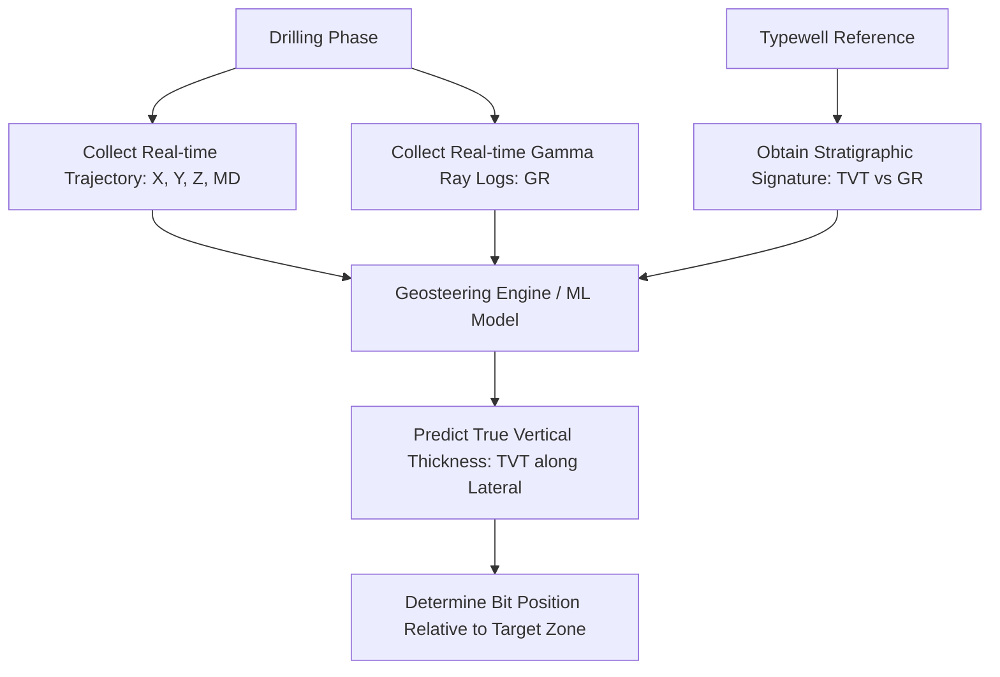

# 01. Competition Background & Geosteering Intuition

In the upstream oil and gas industry, horizontal drilling has revolutionized extraction from unconventional reservoirs (such as shale). However, navigating these horizontal wells—a process known as **Geosteering**—remains a highly complex geological challenge. The **ROGII - Wellbore Geology Prediction** competition challenges data scientists to automate this process.

---

## 1. The Geosteering Problem Statement
When drilling a horizontal wellbore, the drill bit must stay within a very narrow target rock layer (often only 10 to 30 feet thick) over a horizontal lateral length that can extend for 10,000+ feet. 

The primary challenge is that **we cannot directly see the rock layers** at the drill bit. Instead, we have:
1. **Noisy real-time sensors** behind the drill bit, primarily measuring **Gamma Ray (GR)** radiation (measured in API units), which reflects the clay content/lithology of the rock.
2. **Trajectory data** indicating the 3D position ($X, Y, Z$) and Measured Depth (MD) of the wellbore path.
3. **Typewells** (vertical reference wells drilled nearby) which provide the "stratigraphic signature"—a vertical log showing the true sequence of geological layers, their thicknesses, and their characteristic Gamma Ray signatures.

### The Competition Goal
The objective is to predict the **True Vertical Thickness (TVT)** at each point along the horizontal lateral. Specifically, the competition masks the **toe-end** (the final section) of each lateral, and you must predict the TVT trajectory for this hidden portion.



---

## 2. Geological Key Concepts
To build a high-performing model, you must understand the basic coordinate systems and terminology:

*   **Measured Depth (MD):** The actual length of the borehole path from the surface to the drill bit (i.e., how much pipe has been put in the ground).
*   **True Vertical Depth (TVD) / Z Coordinate:** The actual vertical depth below sea level or the surface.
*   **True Vertical Thickness (TVT):** The vertical distance from the top of a reference geological horizon (datum) to a specific point. TVT represents the stratigraphic position or the "floor number" in the rock formation. If the formation is dipping (slanted), the TVT will change even if the wellbore stays at a constant TVD.
*   **Heel and Toe:** The **Heel** is the point where the well trajectory turns from vertical/directional to horizontal. The **Toe** is the very end of the horizontal lateral. The dataset provides the true TVT for the heel-end section, but masks it for the toe-end section.
*   **Structural Changes (Dips and Faults):** Geological formations are rarely perfectly flat. They dip (slope upwards or downwards) and can be displaced by faults.

```
       HEEL (TVT Known)                                   TOE (TVT Masked)
Surface   \
-----------\--------------------------------------------------------------
            \    Wellbore Trajectory
             \_________________________________________________ (Bit)
             /       /                                 /
            /       /  Rock Layer dipping downward    /
           /       /                                 /
          /       /                                 /
```

---

## 3. Why Standard Tabular/Row-wise Machine Learning Fails
A common mistake for data scientists entering this competition is treating the dataset as a standard tabular regression problem, feeding row-wise features `(X, Y, Z, GR)` into LightGBM or CatBoost. This approach fails for several fundamental reasons:

1. **Lack of Absolute Spatial Datum:** Gamma Ray values are not unique. A GR value of 80 API can occur in multiple geological layers. Without knowing the sequential context, a row-wise model cannot distinguish which layer the bit is currently in.
2. **Geometric Constraints (Sequential Continuity):** The wellbore is a continuous physical path. The drill bit cannot teleport vertically between rock layers. The TVT at step $t$ is highly dependent on the TVT at step $t-1$ and the physical trajectory changes ($\Delta Z$, $\Delta X$, $\Delta Y$). Row-wise models ignore these physical kinematics.
3. **Layer Thickness Scaling:** As the wellbore cuts through a layer at an angle, the apparent thickness of the layer along the wellpath (in Measured Depth) stretches or squeezes. Row-wise models cannot resolve this geometric stretching without sequential sequence-alignment logic.
4. **Geological Trends (Dips):** The underlying geological layer boundaries have low-frequency spatial trends (regional dip). A row-wise model has no capacity to extrapolate these low-frequency spatial planes across the masked toe-end.

Therefore, the competition must be framed as a **sequential tracking / state estimation problem**, where the true stratigraphic layer (TVT) is a hidden state, and the noisy Gamma Ray log is an observation.
