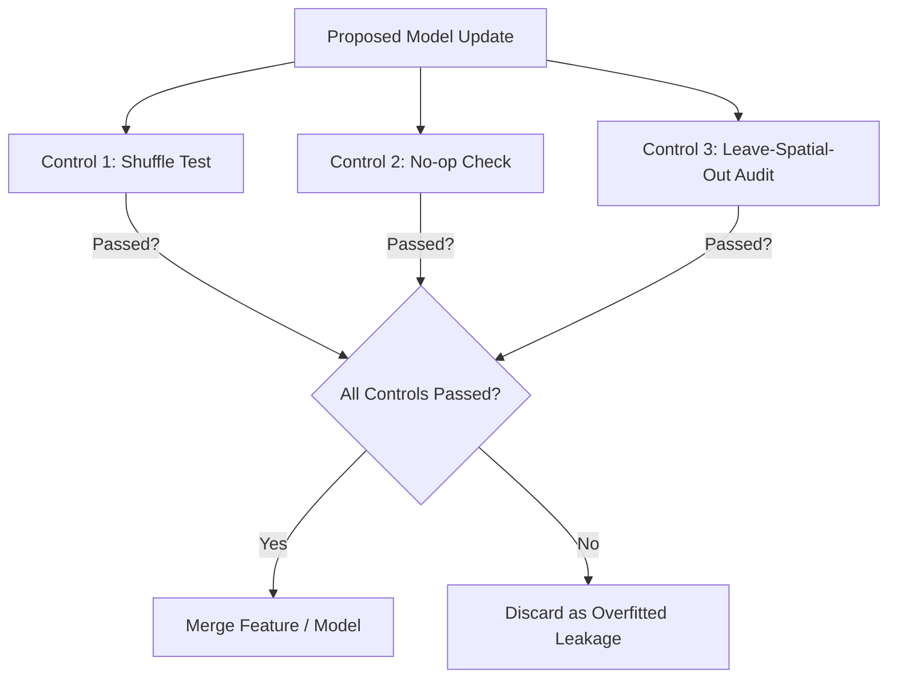

# 03. Validation Strategy & Leakage Prevention

One of the most significant hurdles in the ROGII competition is the discrepancy between local Cross-Validation (CV) and the public Leaderboard (LB). This document breaks down the validation framework, spatial leakage risks, and the defensive engineering techniques documented in `@radiantallomancer`'s award-winning working note, *"When Better CV Scores Worse."*

---

## 1. The CV-LB Anti-Correlation Trap

Many teams observed that as they improved their local CV scores, their public leaderboard scores deteriorated. This anti-correlation is caused by two factors:
1. **Spatial Interpolation vs. Extrapolation:** The training wells and test wells are drilled in spatial clusters. If a model overfits to the regional geological structure of the training cluster, it will perform exceptionally well on local folds that interpolate within that cluster, but fail completely when extrapolating to a test well drilled in a new geological block.
2. **Leaderboard Feedback Loop:** The public leaderboard is calculated on only a portion of the test wells. Tuning hyperparameters directly on the public leaderboard leads to overfitting to the specific structural plane of those few public wells, leading to a catastrophic shakeout on the private leaderboard.

---

## 2. Spatial Leakage & Heel Context
Each test well contains a known "Heel" section where the TVT is provided. Because geological strata are spatially continuous:
*   The known Heel TVT acts as a massive coordinate leak, revealing the local elevation of the geological datum at coordinates $(X_{\text{heel}}, Y_{\text{heel}})$.
*   Standard ML models will memorize the relationship between $(X, Y)$ coordinates and the target TVT. When asked to predict the Toe, the model will simply interpolate the TVT based on the Toe's $(X_{\text{toe}}, Y_{\text{toe}})$ coordinates.
*   **Why this is dangerous:** If there is a local structural fault, dip change, or if the test well is in a different fault block, spatial coordinate interpolation will lead to a massive error.

---

## 3. Validation Controls (Defensive Machine Learning)
To ensure that validation improvements correspond to actual geological tracking rather than spatial memorization, `@radiantallomancer` introduced three validation controls:



### Control 1: The Shuffle Test
*   **Method:** Shuffle the sequence order (the Measured Depth `MD` sequence) of the horizontal well during validation.
*   **Logic:** A model that has successfully learned geosteering physics (correlating the Gamma Ray log sequence to the typewell sequence) should fail completely if the sequence is shuffled. If the model's score remains high after shuffling, it is using spatial coordinate leakage `(X, Y)` to interpolate, rather than actually geosteering.

### Control 2: The No-op Check
*   **Method:** Evaluate the model against a "no-op" baseline (an "anchor-hold" where the last known Heel TVT is held constant across the entire Toe).
*   **Logic:** If an advanced deep learning or GBDT pipeline cannot beat a simple flat baseline in remote geological blocks, it is not generalizable. Any model update must show a statistically significant improvement over the anchor-hold baseline.

### Control 3: Leave-Spatial-Out Audits (Block Cross-Validation)
*   **Method:** Define spatial blocks (clusters of wells) and hold out entire geographical blocks during cross-validation.
*   **Logic:** This simulates the true test setting, forcing the model to extrapolate its dip and structural predictions to a completely unseen spatial region.

---

## 4. Recommended Cross-Validation Setup

To build a reliable local CV, a simple random split is unusable. The pipeline must implement **StratifiedGroupKFold**:

```python
from sklearn.model_selection import StratifiedGroupKFold
import numpy as np

# 1. Group by Well ID to prevent intra-well leakage
groups = df['well_id'].values

# 2. Define Stratification Bins
# We stratify on signed azimuth (drilling direction) and median TVT
df['azimuth_bin'] = pd.qcut(df['drilling_azimuth'], q=4, labels=False)
df['tvt_bin'] = pd.qcut(df['heel_median_tvt'], q=4, labels=False)
df['stratify_label'] = df['azimuth_bin'].astype(str) + "_" + df['tvt_bin'].astype(str)

sgkf = StratifiedGroupKFold(n_splits=5)
for train_idx, val_idx in sgkf.split(df, df['stratify_label'], groups=groups):
    # Train/Validation loop
    # ...
```

### Stratification Rationale
*   **Drilling Azimuth:** Wells drilled North-to-South will cross dipping formations differently than wells drilled East-to-West. Stratifying by azimuth ensures each fold contains representative drilling directions.
*   **Median TVT:** Stratifying by the heel's median TVT ensures that wells representing different layers or formations are balanced across the folds.
