# 04. Signal Decomposition & The Oracle Ladder

A key breakthrough in the competition was presented in the award-winning working note by `@malyshevdanil`, titled *"The Wiggle Is Free, the Trend Is the Wall."* This document explores the mathematical framework of signal decomposition, the problem of geological identifiability, and the "oracle-ceiling ladder" diagnostic tool.

---

## 1. Signal Decomposition: Wiggle vs. Trend

The predicted stratigraphic position ($\text{TVT}_t$) at any point $t$ along the horizontal lateral can be decomposed into two distinct physical components:

$$\text{TVT}_t = \text{Trend}_t + \text{Wiggle}_t$$

### A. The "Wiggle" (High-Frequency Trajectory)
*   **What it is:** The local vertical movements of the drill bit relative to the formation.
*   **Why it is "Free":** The trajectory coordinate ($Z_t$) and Measured Depth ($\text{MD}_t$) are known precisely from the drilling survey logs. Since the wellbore trajectory is continuous and measured with high accuracy, the high-frequency relative changes in TVT are easily calculated from the geometry of the path.
*   **Significance:** Because we know exactly when the drill bit is steering up or down, we can compute the high-frequency component of TVT with minimal error.

### B. The "Trend" (Low-Frequency Geology)
*   **What it is:** The regional dip (tilt angle) and vertical offset (datum elevation) of the rock layers.
*   **Why it is the "Wall":** The earth's crust is tilted. The exact slope (dip) and vertical elevation of the layer boundaries change over space. This low-frequency component is not recorded by any real-time sensor. We must infer it.
*   **Significance:** Over a 10,000-foot lateral, even a tiny error of $0.1^\circ$ in predicting the dip angle accumulates into a massive TVT prediction error at the toe, causing the model to drift completely out of the formation.

```
       Trajectory (Wiggle) - KNOWN             Regional Geological Dip (Trend) - MASKED
       \                                       \_____________________  (Layer Top)
        \______________________                 \
                                                 \___________________  (Layer Bottom)
```

---

## 2. Mathematical Identifiability & The Datum Problem
Why is it so hard to predict the low-frequency trend from Gamma Ray (GR) sensors?

If the drill bit is operating inside a thick shale layer where the GR is constant (e.g., around 110 API), the GR reading is identical whether the bit is at a TVT of 12 feet or 18 feet. From the perspective of the GR log alone:
*   The vertical offset (the **Datum**) is **unidentifiable**.
*   The slope of the formation (the **Dip**) is **unidentifiable**.

Therefore, the GR log sequence can only help resolve the **Shape** of the layer boundaries when the wellbore is actively crossing boundary interfaces (transitions from shale to sandstone, showing sharp GR changes). When the well stays inside a single formation, the model must rely entirely on spatial extrapolation of the trend from the Heel's known TVT.

---

## 3. The "Oracle-Ceiling Ladder" Diagnostics

To quantify where the model's errors originate, `@malyshevdanil` introduced the **Oracle Ladder**. By substituting perfect "oracle" information into different components of the prediction, we can measure their contribution to the total RMSE:

```mermaid
gantt
    title Oracle-Ceiling Error Decomposition (RMSE in feet)
    dateFormat  X
    axisFormat %s
    
    section Error Sources
    Baseline (No-op Anchor-Hold)  :active, 0, 15
    Shape Error Only (Perfect Datum & Dip) :crit, 0, 2
    Slope Error Only (Perfect Datum & Shape) : 0, 6
    Datum Error Only (Perfect Dip & Shape) : 0, 9
```



| Step | Setup | What it tests | Typical RMSE (ft) |
| :--- | :--- | :--- | :--- |
| **Step 0** | **Base Prediction** | Real model prediction at the masked Toe. | **10.5 – 12.0** |
| **Step 1** | **Oracle Datum** | Shift the model's prediction vertically so the starting toe elevation is perfectly aligned. | **7.5 – 9.0** |
| **Step 2** | **Oracle Slope** | Rotate the model's prediction plane so the regional dip angle matches the true geological dip. | **5.0 – 6.0** |
| **Step 3** | **Oracle Shape** | Provide the exact path shape, but with predicted datum/dip. | **8.5 – 10.0** |
| **Ceiling**| **Oracle Datum + Slope** | Perfect low-frequency trend. Only local high-frequency shape errors remain. | **1.2 – 2.0** |

### Key Takeaway for Pipeline Design
The Oracle Ladder proves that **over 80% of the prediction error is caused by incorrect Datum and Slope estimation**, not by local shape mismatch. 

Therefore, trying to improve the model by tuning local sequence matches or adding complex deep-learning layers to process GR wiggles has diminishing returns. High-scoring pipelines must focus on:
1.  **Robust Plane Fitting:** Using training wells in the same cluster to fit a 3D structural plane ($Z = aX + bY + c$) to model the regional dip.
2.  **Anchor Alignment:** Anchoring the prediction at the Heel-Toe transition and projecting the trend forward using the computed regional dip.
