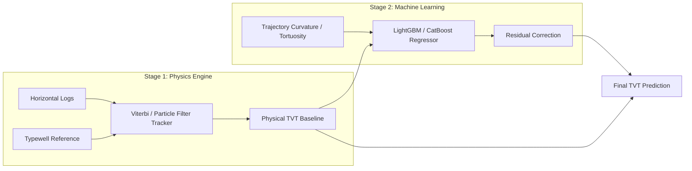

# 05. High-Performing Model Architectures & Logic

High-performing pipelines in the ROGII competition combine physical geosteering trackers with machine learning regressors. This document explains the mathematical logic behind these hybrid architectures.

---

## 1. Hybrid Geosteering Architecture

The top solutions use a two-stage hybrid framework:
1. **Stage 1 (Physics-based State Estimation):** A sequence model (like a Particle Filter or Viterbi Tracker) maps the horizontal Gamma Ray (GR) sequence to the vertical Typewell profile, outputting a physical baseline path ($\text{TVT}_{\text{physics}}$).
2. **Stage 2 (Machine Learning Residual Correction):** A Gradient Boosted Decision Tree (LightGBM/CatBoost) predicts the residual error between the physics baseline and the true TVT, utilizing trajectory and spatial features.

---

## 2. Sequence Tracking: Particle Filters vs. Viterbi

Because TVT is a continuous stratigraphic sequence, we can frame it as a State-Space Model where TVT is the hidden state $S_t$ and the Gamma Ray reading is the observation $O_t$.

### A. The Particle Filter (Probabilistic State Tracking)
A Particle Filter maintains $P$ candidate positions (particles) of where the drill bit could be in TVT space. At each step along the Measured Depth (MD):
1. **Prediction Update:** Particles are projected forward using the change in physical elevation ($\Delta Z$) plus a small noise factor representing geological dip uncertainty.
2. **Measurement Update:** The weight of each particle is updated by comparing the horizontal GR reading to the typewell GR value at that particle's TVT:
   
   $$w_i \propto \exp\left( -\frac{(\text{GR}_{\text{observed}} - \text{GR}_{\text{typewell}}(\text{TVT}_i))^2}{2\sigma^2} \right)$$
   
3. **Resampling:** Particles with low weights are eliminated, while particles with high weights are duplicated. The mean of the particle swarm gives the estimated TVT.

### B. Viterbi Path Tracking (Dynamic Programming)
Instead of step-by-step filtering, Viterbi evaluates the entire wellbore lateral globally. We discretize the TVT state space and define a cost function for transitioning from state $S_{t-1}$ to $S_t$:

$$\text{Cost}(S_{1:T}) = \sum_{t=1}^{T} \underbrace{\mathcal{D}(O_t, \text{GR}_{\text{typewell}}(S_t))}_{\text{Observation Match}} + \lambda \sum_{t=2}^{T} \underbrace{\mathcal{T}(S_t - S_{t-1}, \Delta Z_t)}_{\text{Transition Penalty}}$$

*   **Observation Match ($\mathcal{D}$):** Measures how well the Gamma Ray reading matches the typewell layer signature.
*   **Transition Penalty ($\mathcal{T}$):** Penalizes transitions that violate physical trajectory constraints (e.g., if the trajectory goes down 2 feet, the TVT change should be close to 2 feet, accounting for dip).
*   **Dynamic Warping Optimization:** Using the Viterbi algorithm or dynamic programming, we find the globally optimal path that minimizes the total cost across the entire sequence.

---

## 3. Key Feature Engineering

To help the GBDT models correct the sequence tracker's predictions, the following features are engineered:

### A. Q-3D Wellbore Tortuosity
Tortuosity represents how much the well path curves. High tortuosity indicates areas where the driller was actively steering to stay inside a dipping layer, highlighting geological boundaries:

$$\text{Tortuosity} = \int \left( \left(\frac{d\theta}{ds}\right)^2 + \sin^2\theta \left(\frac{d\phi}{ds}\right)^2 \right) ds$$

Where:
*   $\theta$ is wellbore inclination.
*   $\phi$ is wellbore azimuth.
*   $s$ is measured depth along the path.

### B. Multi-Scale Sliding Distance Correlation (`dcor_sliding`)
Standard Pearson correlation only measures linear relationships. Because geological logs are highly non-linear, high-performing models run a sliding window and compute the **Distance Correlation** between the horizontal well segment and the vertical typewell. This features identifies if a pattern of wiggles in the horizontal GR matches the characteristic shale/sand boundaries in the vertical reference well.

### C. Distance-to-Nearest-Typewell
Calculates the spatial distance to the nearest vertical typewell. When a test well is far from any reference typewell, the confidence in the Viterbi match drops, signaling the LightGBM model to rely more on the low-frequency regional plane-fit trend.
